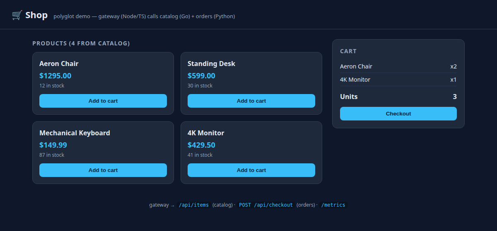
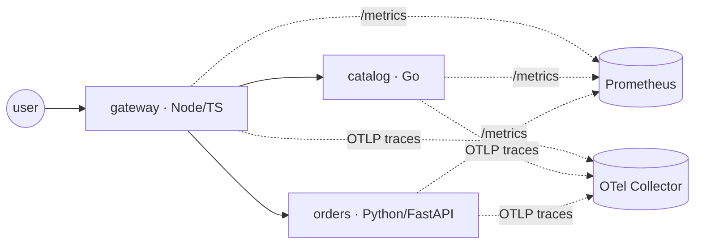

# polyglot-microservices — one app, three languages, three CI systems

A small **shop** reference app built to exercise a real container delivery pipeline:
three services in three languages, multi-stage **distroless** images, a supply-chain
gate (**Trivy → SBOM → Cosign**), a per-env **Helm** chart, and the **same pipeline
implemented in GitHub Actions, GitLab CI, and Jenkins** as a side-by-side comparison.

> Project 2 of a 4-part platform series:
> eks-platform → **polyglot-microservices** → k8s-observability → progressive-delivery.

[](.github/workflows/ci.yaml)
[](#services)
[](#supply-chain)

## Demo

Run the whole app locally and open <http://localhost:8080>:

```bash
docker compose up --build     # builds + runs catalog, orders, gateway
# open http://localhost:8080 — add items, checkout
docker compose down
```

The browser talks only to the **gateway** (Node/TS), which calls **catalog** (Go) for
products and **orders** (Python) on checkout:

| Products from `catalog`, cart populated | Checkout → order created by `orders` |
|:---:|:---:|
|  |  |

## Architecture



Each service exposes `/healthz`, `/readyz`, Prometheus `/metrics`, optional OTLP tracing,
and the `FAILURE_RATE` / `LATENCY_MS` **chaos knobs** that Repos 3 (alerts) and 4
(auto-rollback) drive.

## Services

| Service | Language | Role | Image base | Size |
|---|---|---|---|---|
| `gateway` | Node 22 / TypeScript | Front door, calls the two backends, serves a tiny UI | distroless/nodejs22 | ~216 MB |
| `catalog` | Go 1.25 | Product catalog API | distroless/static | ~27 MB |
| `orders` | Python 3.11 / FastAPI | Order processing API | distroless/python3 | ~118 MB |

Data is in-memory behind an interface (a Postgres/Redis seam); the chart can also
provision Postgres + Redis (`--set postgres.enabled=true`) to show the pattern.

## CI: the same pipeline, three ways

All three run the identical stage graph:

```
lint + test  →  build  →  Trivy scan (gate)  →  SBOM (syft)  →  Cosign sign  →  push  →  GitOps bump
```

| Dimension | GitHub Actions | GitLab CI | Jenkins |
|---|---|---|---|
| File | [.github/workflows/ci.yaml](.github/workflows/ci.yaml) | [.gitlab-ci.yml](.gitlab-ci.yml) | [Jenkinsfile](Jenkinsfile) |
| Config | YAML, job-centric | YAML, stage-centric | Groovy DSL (declarative) |
| Runners | GitHub-hosted / self-hosted | shared / self-hosted + DinD | controller + agents (great on k8s) |
| Polyglot fan-out | `strategy.matrix` (per-lang `if`) | `parallel:matrix` + per-lang jobs | `parallel` + `matrix` |
| Build cache | `type=gha` buildx cache | DinD layer cache / registry | workspace / configurable |
| Registry | GHCR (`GITHUB_TOKEN`) | GitLab Registry (`$CI_REGISTRY_*`) | any (creds plugin) |
| Keyless signing | OIDC (`id-token: write`) | `id_tokens: SIGSTORE_ID_TOKEN` | OIDC via plugin / token |
| Best fit | OSS / GitHub-native | all-in-one GitLab shops | enterprise / on-prem, k8s agents |

Full write-up: [docs/ci-comparison.md](docs/ci-comparison.md).

## Supply chain

Every image, in every pipeline:

1. **Trivy** scans for fixable HIGH/CRITICAL vulns and **fails the build** if any exist.
2. **Syft** produces an SPDX SBOM (uploaded as a build artifact).
3. **Cosign** keyless-signs the pushed image (OIDC; no long-lived keys).

## Quickstart

```bash
make test        # go + pytest/ruff + tsc/node tests for all three services
make build       # build all three distroless images locally
make scan        # Trivy gate on the built images
make helm-lint   # lint + render the chart for dev/staging/prod

# run the whole app on a kind cluster (needs a cluster named $KIND_CLUSTER):
make dev         # build -> kind load -> helm install
kubectl -n shop port-forward svc/gateway 8080:8080   # then open http://localhost:8080
```

## Deploy (GitOps)

[deploy/argocd/shop-app.yaml](deploy/argocd/shop-app.yaml) is an ArgoCD `Application`
that deploys the chart onto the **eks-platform** (Repo 1) cluster. Reference it from that
repo's app-of-apps, or `kubectl apply -f` it directly. Set `repoURL` and the image registry.

## Repository layout

```
services/{catalog,orders,gateway}/   # one dir per service (code + tests + Dockerfile)
deploy/helm/shop/                     # umbrella chart (services templated via a range)
deploy/argocd/shop-app.yaml           # ArgoCD Application for Repo 1's cluster
.github/workflows/ci.yaml             # CI #1
.gitlab-ci.yml                        # CI #2
Jenkinsfile                           # CI #3
docs/                                 # architecture, CI comparison
```

## Decisions & trade-offs

- **Three languages on purpose** — proves the pipeline is language-agnostic and shows
  idiomatic test/lint per stack (go test, ruff+pytest, tsc+node:test).
- **Distroless, non-root, read-only rootfs** — minimal attack surface; the Go image is ~27 MB.
  Python/Node need the interpreter, hence larger — an honest trade-off shown in the table.
- **Trivy `--ignore-unfixed`** — gate on what you can actually act on; unfixable base-OS CVEs
  don't block delivery (they're tracked, not ignored silently).
- **One chart, services as a range** — adding a service is a values entry, not new templates.
- **Same pipeline ×3** — the portfolio point: the delivery *shape* is identical; only the CI
  ergonomics differ (see the comparison table).
- **In-memory data + optional Postgres/Redis** — keeps the app testable and $0 by default,
  with the data-layer pattern one flag away.

## License

[MIT](LICENSE)
