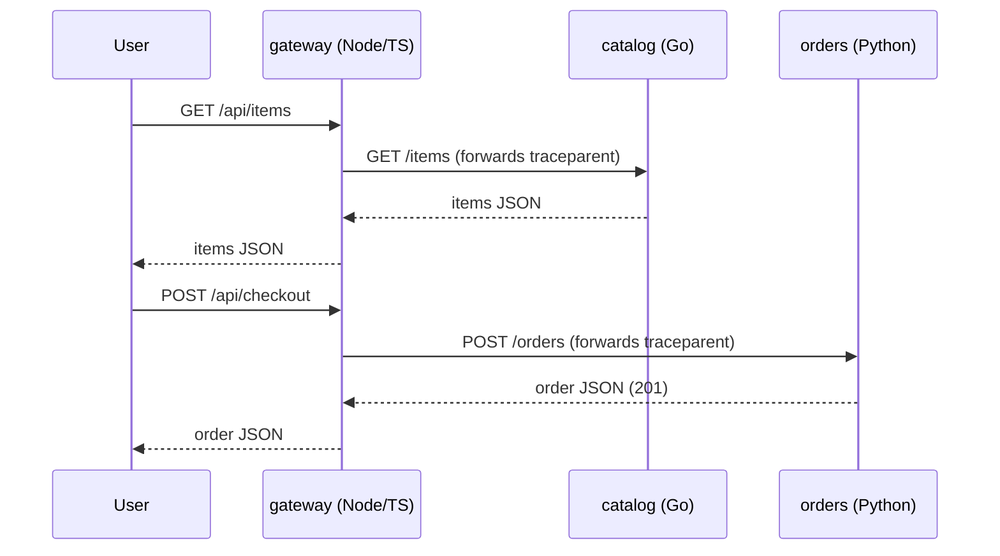
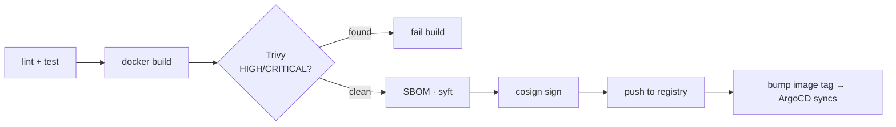

# Architecture

## Request flow

## Observability hooks (consumed by Repo 3)

- **Metrics** — every service exposes `/metrics` with RED-method series
  (`http_requests_total`, `http_request_duration_seconds`). The chart sets
  `prometheus.io/scrape` annotations and can emit `ServiceMonitor`s
  (`serviceMonitor.enabled=true`).
- **Traces** — OTLP/HTTP when `OTEL_EXPORTER_OTLP_ENDPOINT` is set; the gateway forwards
  W3C `traceparent` so spans join one trace across services.
- **Chaos knobs** — `FAILURE_RATE` and `LATENCY_MS` env vars let Repo 4 ship a "bad" version
  that trips burn-rate alerts and triggers automated rollback.

## Delivery pipeline

Implemented identically in GitHub Actions, GitLab CI, and Jenkins — see
[ci-comparison.md](ci-comparison.md).

## Image strategy

Multi-stage builds; runtime is distroless + non-root + read-only root filesystem with all
Linux capabilities dropped. The Go service compiles to a static binary on
`distroless/static` (~27 MB); Python and Node ship on their distroless interpreters.
